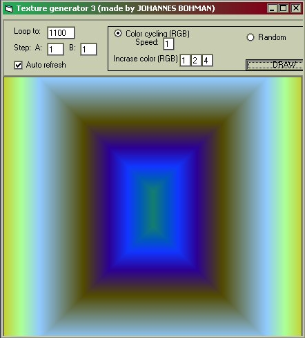



## TEXTURE GENERATOR 3\!\!\! VERY FAST AND COOL TEXTURE MAKING PROGRAM\!\! \(this is a must see\!\)

### Description

This is a very cool program that generates cool textures! Please vote cuz this is cool!
 
### More Info
 

             |
---                |---
**Submitted On**   |1996-11-16 16:03:28
**By**             |[Johannes B](https://github.com/Planet-Source-Code/PSCIndex/blob/master/ByAuthor/johannes-b.md)
**Level**          |Beginner
**User Rating**    |5.0 (50 globes from 10 users)
**Compatibility**  |VB 5\.0, VB 6\.0
**Category**       |[Graphics](https://github.com/Planet-Source-Code/PSCIndex/blob/master/ByCategory/graphics__1-46.md)
**World**          |[Visual Basic](https://github.com/Planet-Source-Code/PSCIndex/blob/master/ByWorld/visual-basic.md)
**Archive File**   |[CODE\_UPLOAD1187111202000\.zip](https://github.com/Planet-Source-Code/johannes-b-texture-generator-3-very-fast-and-cool-texture-making-program-this-is-a-must-se__1-12834/archive/master.zip)

